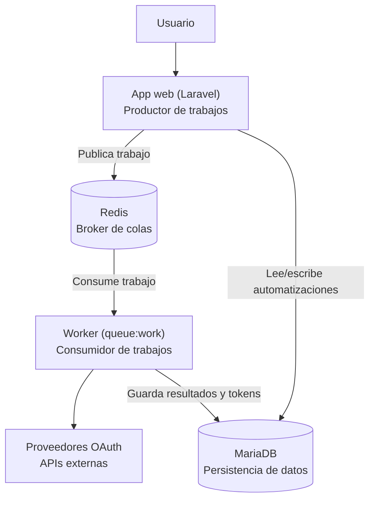

# FlowHub

| | |
|---|---|
| **Universidad** | Universidad Técnica Nacional |
| **Carrera** | Ingeniería del Software |
| **Curso** | ISW-811 — Aplicaciones Web utilizando Software Libre |
| **Asignación** | 2.º Proyecto Programado |
| **Profesor** | Misael Matamoros Soto |

## Integrantes

| Nombre | Usuario de GitHub |
|---|---|
| Xavier Fernández | [@xaviferzun](https://github.com/xaviferzun) |
| Álvaro Víctor Zamora | [@alvi014](https://github.com/alvi014) |

---

## 1. Descripción del proyecto

**FlowHub** es una plataforma web de automatización personal que permite a cada
usuario conectar sus aplicaciones y servicios en línea para que "conversen" entre
sí sin intervención manual, mediante la definición de automatizaciones del tipo
*"cuando ocurra X, entonces haz Y (y luego Z)"*.

Cada automatización se compone de:

- **Disparador (trigger):** condición que inicia la automatización (basada en
  eventos o en tiempo).
- **Condiciones (opcionales):** filtros que determinan si la automatización debe
  continuar.
- **Acciones (actions):** operaciones ejecutadas como consecuencia del disparador,
  encadenables en secuencia.

La plataforma actúa en nombre del usuario sobre servicios de terceros mediante
**OAuth con permisos delegados**, y ejecuta las automatizaciones de forma
**asíncrona y desacoplada**: la aplicación web publica los trabajos en un broker de
mensajería, y un proceso *worker* independiente los consume y ejecuta.

## 2. Objetivos

- Aplicar conceptos de programación web con rigurosidad comercial utilizando
  Software Libre.
- Implementar un motor de automatización desacoplado mediante colas de mensajes.
- Integrar servicios de terceros a través de OAuth 2.0 con permisos delegados.
- Aplicar buenas prácticas de control de versiones y trabajo colaborativo bajo
  metodología Scrum (Jira).

## 3. Arquitectura

FlowHub separa la publicación de trabajos (productor) de su ejecución
(consumidor), comunicándose de forma asíncrona a través de un broker de
mensajería. Esto evita que la ejecución de acciones sobre proveedores externos
bloquee la petición HTTP del usuario.



**Componentes:**

- **App web (Laravel):** recibe las peticiones del usuario, gestiona la
  configuración de automatizaciones (disparadores, condiciones y acciones) y las
  persiste en MariaDB. Actúa como **productor**: nunca ejecuta acciones
  directamente durante la petición HTTP, solo publica el trabajo en la cola.
- **Redis:** actúa como **broker de mensajería**, desacoplando la publicación del
  trabajo de su ejecución.
- **Worker (`php artisan queue:work`):** proceso independiente que actúa como
  **consumidor**, procesando los trabajos de la cola, ejecutando la cadena de
  acciones correspondiente, y persistiendo los resultados de ejecución en
  MariaDB.
- **MariaDB:** capa de persistencia compartida entre ambos procesos — almacena
  las automatizaciones configuradas, los tokens OAuth cifrados, y el historial de
  ejecuciones.
- **Proveedores OAuth:** servicios externos con los que el worker interactúa en
  nombre del usuario, mediante tokens obtenidos por delegación (OAuth 2.0).

*(Pendiente ampliar con el detalle del patrón adaptador por proveedor, el manejo
de reintentos/backoff, y la cola de mensajes fallidos (DLQ), a medida que avance
la implementación.)*

## 4. Tecnologías utilizadas

| Componente | Tecnología |
|---|---|
| Backend | Laravel 12 (PHP 8.2) |
| Base de datos | MariaDB |
| Broker de mensajería / colas | Redis (cliente `predis/predis`) |
| Frontend | Vite + Tailwind CSS |
| Control de versiones | Git + GitHub |
| Gestión de proyecto | Jira (metodología Scrum) |

## 5. Requisitos previos

- PHP 8.2 y Composer
- MariaDB (o motor MySQL compatible)
- Redis Server
- Node.js y npm (para compilar assets de frontend)

Cada integrante del equipo trabaja sobre su propia máquina virtual (Vagrant,
Debian 12, PHP 8.2, Apache, MariaDB), replicando el entorno de forma
independiente, igual que en el Proyecto 1 del curso.

## 6. Instalación y configuración del entorno

### 6.1. Clonar el repositorio

```bash
git clone https://github.com/xaviferzun/flowhub.ISW811.xyz.git
cd flowhub.ISW811.xyz
```

Configurar la identidad de Git con la cuenta propia de cada integrante, de modo
que los commits reflejen correctamente los aportes individuales:

```bash
git config user.name "<tu-usuario-de-github>"
git config user.email "<tu-correo>"
```

### 6.2. Instalar dependencias de PHP

```bash
composer install
```

### 6.3. Instalar y activar Redis (si la VM no lo tiene aún)

```bash
sudo apt update
sudo apt install redis-server -y
sudo systemctl enable redis-server --now
redis-cli ping   # debe responder PONG
```

### 6.4. Configurar variables de entorno

```bash
cp .env.example .env
php artisan key:generate
```

> **Nota de seguridad:** ningún valor real de credenciales (contraseñas, tokens,
> client secrets) debe quedar versionado en el repositorio. El archivo `.env` está
> excluido mediante `.gitignore`; `.env.example` solo documenta qué variables
> existen, sin valores sensibles. Cada integrante define sus propios valores
> locales directamente en su `.env`, nunca en este documento ni en el repositorio.

Variables relevantes a definir en el `.env` local de cada integrante:

```dotenv
DB_CONNECTION=mysql
DB_HOST=localhost
DB_PORT=3306
DB_DATABASE=<nombre_de_tu_base_de_datos>
DB_USERNAME=<tu_usuario_de_base_de_datos>
DB_PASSWORD=<tu_contraseña>

QUEUE_CONNECTION=redis
REDIS_CLIENT=predis
REDIS_HOST=127.0.0.1
REDIS_PORT=6379
```

### 6.5. Crear la base de datos local

Cada integrante crea su propia base de datos, independiente de la de sus
compañeros:

```bash
sudo mysql -e "CREATE DATABASE <nombre_de_tu_base_de_datos>; \
CREATE USER IF NOT EXISTS '<tu_usuario_de_base_de_datos>'@'localhost' IDENTIFIED BY '<tu_contraseña>'; \
GRANT ALL PRIVILEGES ON <nombre_de_tu_base_de_datos>.* TO '<tu_usuario_de_base_de_datos>'@'localhost'; \
FLUSH PRIVILEGES;"
```

### 6.6. Ejecutar las migraciones

```bash
php artisan migrate
```

### 6.7. Verificar el ciclo productor-worker

El repositorio incluye un `TestJob` de prueba (`app/Jobs/TestJob.php`) para validar
que la aplicación (productor) publica trabajos en Redis correctamente y que un
worker (consumidor) los procesa:

```bash
php artisan tinker --execute="dispatch(new \App\Jobs\TestJob());"
php artisan queue:work redis --once -v
tail -n 5 storage/logs/laravel.log
```

Si el log muestra el mensaje `Job de prueba ejecutado correctamente desde
TestJob`, el entorno queda funcional de extremo a extremo.

### 6.8. Servir la aplicación (Apache, opcional)

Si la VM utiliza Apache con VirtualHosts, configurar un vhost cuyo `DocumentRoot`
apunte a la carpeta `public/` del proyecto, y agregar el dominio elegido al
archivo `hosts` local, apuntando a la IP de la VM correspondiente.

### 6.9. Instalar dependencias de JavaScript (opcional, para frontend)

```bash
npm install
npm run build
```

## 7. Flujo de trabajo (Git + Jira)

El equipo sigue una convención de ramas ligadas a tareas de Jira (clave `FH-X`):

| Tipo de tarea | Prefijo de rama | Ejemplo |
|---|---|---|
| Feature / implementación | `feature/FH-X` | `feature/FH-12` |
| Corrección de bug | `bug/FH-X` | `bug/FH-15` |

Cada tarea avanza por los estados **Por hacer → En curso → En revisión →
Finalizado**. Al completar el trabajo de una rama y mergear su Pull Request, se
deja constancia en un comentario de la tarea correspondiente en Jira, describiendo
el alcance cumplido y las decisiones tomadas.

## 8. Licencia

Proyecto académico desarrollado como parte del curso ISW-811 de la Universidad
Técnica Nacional. Sin fines comerciales.
